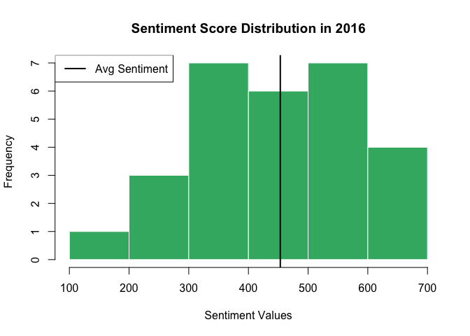
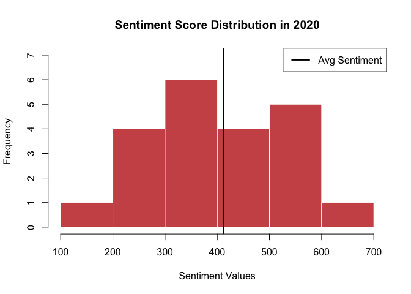
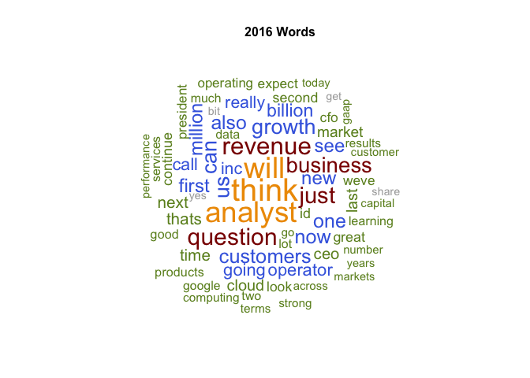
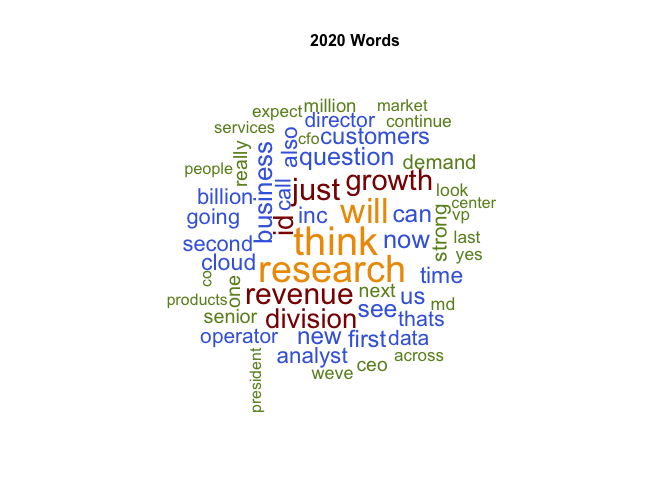
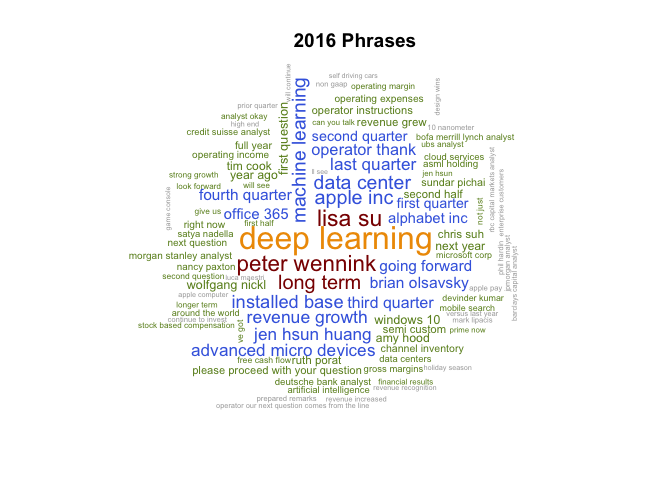
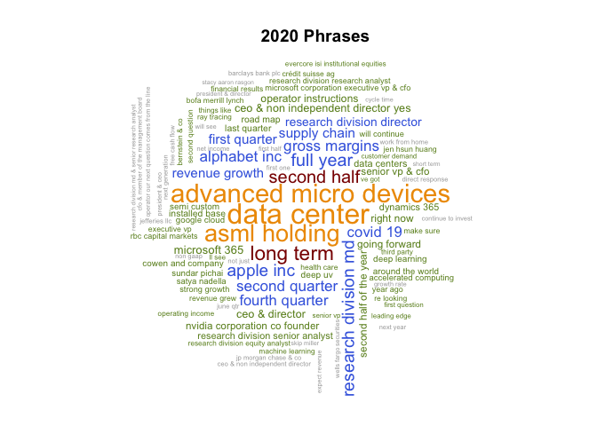
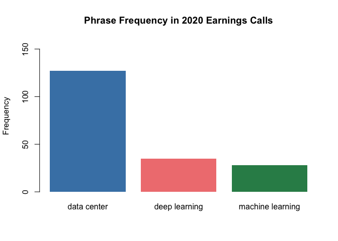
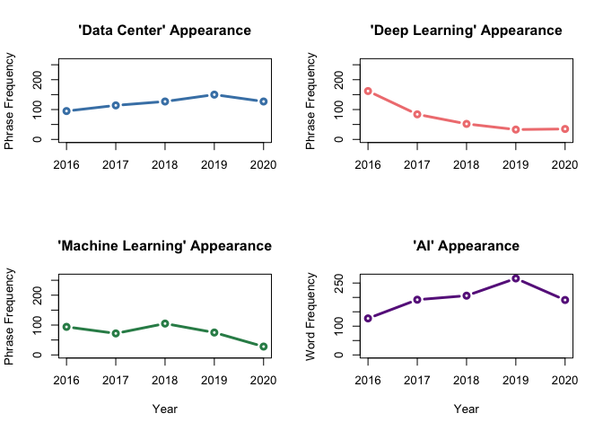
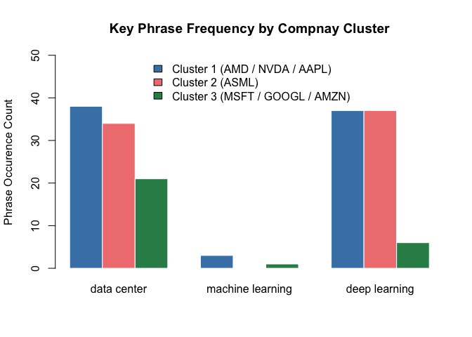

Earnings Call Analysis
================
Young Han
2025-05-11

## Project objective:

Using text mining and sentiment analysis to analyze earnings call
transcripts from seven major technology companies between 2016 and 2020.
The goal is to uncover hidden trends in management language, quantify
sentiment shifts, and identify emerging strategic themes across the
market.

### Load libraries

``` r
################################################################################
# External Functions
################################################################################
library(readtext)
library(pdftools)
```

    ## Using poppler version 23.04.0

``` r
library(tm)
```

    ## Loading required package: NLP

``` r
library(smallstuff)
library(data.table)
library(magrittr)
library(stringr)
library(phm)
library(wordcloud)
```

    ## Loading required package: RColorBrewer

``` r
library(wordcloud2)
library(tidytext)
library(sur)
################################################################################
# Internal Functions
################################################################################
################################################################################
# Save the environment
################################################################################
parSave=par(no.readonly = TRUE)
#par(parSave)
################################################################################
# Processing
################################################################################
```

### Load texts and turn them into corpora

``` r
(rt=readtext("data/*_*.txt",
             docvars='filen',
             docvarn=c('date','id'),
             dvsep = '_'))
```

    ## readtext object consisting of 133 documents and 2 docvars.
    ## # A data frame: 133 × 4
    ##   doc_id               text                  date       id   
    ##   <chr>                <chr>                 <chr>      <chr>
    ## 1 2016-01-19_AMD.txt   "\"\n\nThomson \"..." 2016-01-19 AMD  
    ## 2 2016-01-20_ASML.txt  "\"\n\nThomson \"..." 2016-01-20 ASML 
    ## 3 2016-01-26_AAPL.txt  "\"\n\nThomson \"..." 2016-01-26 AAPL 
    ## 4 2016-01-28_AMZN.txt  "\"\n\nThomson \"..." 2016-01-28 AMZN 
    ## 5 2016-01-28_MSFT.txt  "\"\n\nThomson \"..." 2016-01-28 MSFT 
    ## 6 2016-02-01_GOOGL.txt "\"\n\nThomson \"..." 2016-02-01 GOOGL
    ## # ℹ 127 more rows

``` r
(co=rt %>% DFSource %>% VCorpus)
```

    ## <<VCorpus>>
    ## Metadata:  corpus specific: 0, document level (indexed): 0
    ## Content:  documents: 133

``` r
meta(co[[55]])
```

    ##   author       : character(0)
    ##   datetimestamp: 2017-11-02
    ##   description  : character(0)
    ##   heading      : character(0)
    ##   id           : AAPL
    ##   language     : en
    ##   origin       : character(0)
    ##   doc_id       : 2017-11-02_AAPL.txt

### Create title of each earnings call per company

``` r
textNum=co %>% length
for (i in 1:textNum){
  txt=co[[i]] %>% content
  first200=substring(txt,1,200)     
  yr=co[[i]] %>% meta('datetimestamp')
  cp=co[[i]] %>% meta('id')
  
  if (grepl('Q1',first200)){
    meta(co[[i]],'title')=paste(cp,'Q1',yr,'earnings call')
  } else if (grepl('Q2',first200)) {
    meta(co[[i]],'title')=paste(cp,'Q2',yr,'earnings call')
  } else if (grepl('Q3',first200)) {
    meta(co[[i]],'title')=paste(cp,'Q3',yr,'earnings call')
  } else 
    meta(co[[i]],'title')=paste(cp,'Q4',yr,'earnings call')
}
lapply(co,meta)[1:2]
```

    ## $AMD
    ##   author       : character(0)
    ##   datetimestamp: 2016-01-19
    ##   description  : character(0)
    ##   heading      : character(0)
    ##   id           : AMD
    ##   language     : en
    ##   origin       : character(0)
    ##   doc_id       : 2016-01-19_AMD.txt
    ##   title        : AMD Q4 2016-01-19 earnings call
    ## 
    ## $ASML
    ##   author       : character(0)
    ##   datetimestamp: 2016-01-20
    ##   description  : character(0)
    ##   heading      : character(0)
    ##   id           : ASML
    ##   language     : en
    ##   origin       : character(0)
    ##   doc_id       : 2016-01-20_ASML.txt
    ##   title        : ASML Q4 2016-01-20 earnings call

### Clean up texts

``` r
for (i in 1:textNum){
  txt=content(co[[i]])
  text=unlist(strsplit(txt,'\n'))
  # For Disclaimer
  end = grep('Disclaimer', text)[1] - 1
  text_trimmed = text[1:end]
  
  cleaning = paste(text_trimmed, collapse='-')

  ####################################
  
  cleaning=gsub('\\[\\d+\\]','',cleaning)
  cleaning=gsub('[-=\\*\\/]',' ',cleaning)
  cleaning=str_squish(cleaning)
  content(co[[i]])= cleaning
}
substring(content(co[[56]]),1,800)
```

    ## [1] "Thomson Reuters StreetEvents Event Transcript E D I T E D V E R S I O N Q3 2018 Nvidia Corp Earnings Call NOVEMBER 09, 2017 10:00PM GMT Corporate Participants Jensen Hsun Huang NVIDIA Corporation Co Founder, CEO, President & Director Colette M. Kress NVIDIA Corporation Executive VP & CFO Simona Jankowski Conference Call Participiants Toshiya Hari Goldman Sachs Group Inc., Research Division MD Christopher Caso Raymond James & Associates, Inc., Research Division Research Analyst Vivek Arya BofA Merrill Lynch, Research Division Director Joseph Lawrence Moore Morgan Stanley, Research Division Executive Director Stacy Aaron Rasgon Sanford C. Bernstein & Co., LLC., Research Division Senior Analyst Atif Malik Citigroup Inc, Research Division VP and Semiconductor Capital Equipment and Specialty Se"

### Create corpus for each year

- Splitting by year to calculate sentiment difference by each year

``` r
co2016=co[1:28]
co2017=co[29:56]
co2018=co[57:84]
co2019=co[85:112]
co2020=co[113:133]

# Term-document & sentiment ###################################################
afin=as.data.table(get_sentiments('afin'))

myCol=c('darkgrey','olivedrab','royalblue','red4','orange2')
```

### Set stop words and create term document matrix for each year

``` r
myStopwords = c(stopwords(),'sync','well','thank','like','right','pretty',
                'gross','marginal','marginally','margin','please','thanks',
                'year','quarter')
```

- Some words such as ‘gross’, ‘margin’, and ‘cloud’ are added because
  the sentiment dictionary flags them as negative terms. In a financial
  context, they are considered as neutral.

``` r
for (i in 2016:2020){
  yearCorpus = get(paste0('co',i))
  tdm=TermDocumentMatrix(yearCorpus,
                         control = list(removePunctuation=T,
                                        stopwords=myStopwords,
                                        removeNumbers=T,
                                        wordLengths=c(2,Inf),
                                        stemming=F,
                                        bounds=list(global=c(7,Inf))))%>%
    as.matrix
  assign(paste0('tdm',i),tdm)
}
```

- Set global bounds to include words that appear in at least 7 documents
  across the entire corpus for each year to filter out noisy words.

### Frequent terms & sentiment

- Focus on the 2016 and 2020 corpora for a comparative analysis. This
  period was chosen to test for a significant shift in sentiment and
  strategic focus also 5 year gap would allow enough time for major
  technological trends to mature and be reflected in executive
  communication.

``` r
# 2016 histogram
tdt16=as.data.table(tdm2016,keep.rownames = 'word')
tdt16=tdt16[afin,on=.(word),nomatch = NULL]

csums16=colSums(tdt16[,-c('word','value')])
docs16=which(csums16!=0)

tdt16=tdt16[,-c('word','value')]*tdt16$value
sum16=colSums(tdt16)
hist(sum16,main = 'Sentiment Score Distribution in 2016',
     xlab='Sentiment Values',
     col='mediumseagreen',border='white',freq = T,ylim=c(0,7))
skew.ratio(sum16)
```

    ## [1] -0.2943321

``` r
mean(sum16)
```

    ## [1] 453.3929

``` r
abline(v=mean(sum16),col='black',lwd=2)
legend('topleft',
       legend = "Avg Sentiment",
       lty = 1, lwd = 2,
       col = 'black')
```

<!-- -->

``` r
# 2020 histogram
tdt20=as.data.table(tdm2020,keep.rownames = 'word')
tdt20=tdt20[afin,on=.(word),nomatch = NULL]

csums20=colSums(tdt20[,-c('word','value')])
docs20=which(csums20!=0)

tdt20=tdt20[,-c('word','value')]*tdt20$value
sum20=colSums(tdt20)
hist(sum20,main = 'Sentiment Score Distribution in 2020',
     xlab='Sentiment Values',
     border = 'white',col = 'indianred3',freq = T,ylim=c(0,7))
skew.ratio(sum20)
```

    ## [1] 0.02258895

``` r
mean(sum20)
```

    ## [1] 411.9524

``` r
abline(v=mean(sum20),col='black',lwd=2)
legend('topright',
       legend = "Avg Sentiment",
       lty = 1, lwd = 2,
       col = 'black')
```

<!-- -->

``` r
# 2016 word cloud
sums16=rowSums(tdm2016)
dt16=data.table(word=names(sums16),freq=sums16)
dt16[word=='data']
```

    ##      word  freq
    ##    <char> <num>
    ## 1:   data   281

``` r
set.seed(123)
wordcloud(names(sums16),sums16,min.freq = 220, colors=myCol,random.order = F,
          scale = c(2.5,0.5))
title('2016 Words',cex.main=1)
```

<!-- -->

``` r
# 2020 word cloud
sums20=rowSums(tdm2020)
dt20=data.table(word=names(sums20),freq=sums20)
dt20[word=='data']
```

    ##      word  freq
    ##    <char> <num>
    ## 1:   data   334

``` r
set.seed(123)
wordcloud(names(sums20),sums20,min.freq = 200, colors=myCol,random.order = F,
          scale = c(2.5,0.5))
title('2020 Words',cex.main=1)
```

<!-- -->

- The initial word cloud analysis highlighted ‘data’ as a term of
  increasing importance (frequency grew from 281 in 2016 to 334 in
  2020). We came up a hypothesis that the rise of the general term
  ‘data’ might be linked to a more specific, strategic focus on
  infrastructure, represented by the phrase ‘data center’.

### Phrase mining

- Redundant phrases frequently used in earnings call are included in
  stop phrases

``` r
myStopPhrases=
  c('<sync id','re seeing','little bit','ve seen','year over year',
    'constant currency','last year','year on year','ceo & director <sync id',
    'operator and our next question comes','ve talked','re going',
    'rights reserved','>in terms','>i think','ceo and president',
    'chairman of the management board','member of the management board',
    'operator the next question comes from mr', 'good afternoon',
    'edited transcript','accurate transcription', 'press release',
    'actual results may differ materially from those stated',
    'although the companies may indicate and believe','applicable company', 
    'applicable company assume any responsibility for any investment',
    'assumptions could prove inaccurate or incorrect',
    'ssumptions underlying the forward looking statements are reasonable',
    'assurance that the results contemplated in the forward', 
    'based upon the information provided on this web',
    'call and while efforts are made to provide','morgan stanley',
    'conference call participiants','gross margin', 'conference call',
    'conference calls upon which event transcripts are based', 
    'contained in event transcripts is a textual representation')
```

``` r
# 2016 phrase cloud
pd16=phraseDoc(co2016)
```

``` r
# 2016 phrase cloud
pd16=removePhrases(pd16,myStopPhrases)
pdm16=as.matrix(pd16)
fp16=freqPhrases(pd16,100)
fp16dt=data.table(phrase=rownames(fp16),freq=fp16[,1])
fp16dt[phrase=='data center']
```

    ##         phrase  freq
    ##         <char> <int>
    ## 1: data center    95

``` r
set.seed(123)
wordcloud(rownames(fp16),fp16[,1],colors = myCol,random.order = F,
          scale = c(2,.1))
title('2016 Phrases')
```

<!-- -->

``` r
# 2016 bar plot
fp16tb=fp16dt[phrase %in% c('data center','deep learning','machine learning')]
barplot(fp16tb$freq~fp16tb$phrase,col=c('steelblue','lightcoral','seagreen'),
        ylab='Frequency',xlab=NA,border=NA,ylim=c(0,160),
        main = 'Phrase Frequency in 2016 Earnings Calls')
```

<!-- -->

``` r
# 2020 phrase cloud
pd20=phraseDoc(co2020)
```

``` r
# 2020 phrase cloud
pd20=removePhrases(pd20,myStopPhrases)
pdm20=as.matrix(pd20)
fp20=freqPhrases(pd20,100)
fp20dt=data.table(phrase=rownames(fp20),freq=fp20[,1])
fp20dt[phrase=='data center']
```

    ##         phrase  freq
    ##         <char> <int>
    ## 1: data center   127

``` r
set.seed(123)
wordcloud(rownames(fp20),fp20[,1],colors = myCol,random.order = F,
          scale = c(2,.1))
title('2020 Phrases')
```

<!-- -->

``` r
# 2020 bar plot
fp20tb=fp20dt[phrase %in% c('data center','deep learning','machine learning')]
barplot(fp20tb$freq~fp20tb$phrase,col=c('steelblue','lightcoral','seagreen'),
        ylab='Frequency',xlab=NA,border=NA,ylim=c(0,160),
        main = 'Phrase Frequency in 2020 Earnings Calls')
```

<!-- -->

- Phrase ‘data center’ increased over time
- Investigate further on these phrases: data center, deep learning,
  machine learning

``` r
# line plot: phrases frequency over time
pd17=phraseDoc(co2017)
pd18=phraseDoc(co2018)
pd19=phraseDoc(co2019)
```

``` r
# line plot: phrases frequency over time
pp=c('data center','deep learning','machine learning')

pd17=removePhrases(pd17,myStopPhrases)
pd18=removePhrases(pd18,myStopPhrases)
pd19=removePhrases(pd19,myStopPhrases)

dc16=rowSums(getDocs(pd16,pp))
dc17=rowSums(getDocs(pd17,pp))
dc18=rowSums(getDocs(pd18,pp))
dc19=rowSums(getDocs(pd19,pp))
dc20=rowSums(getDocs(pd20,pp))

(myPhrases=rbind('2016'=dc16,'2017'=dc17,'2018'=dc18,'2019'=dc19,'2020'=dc20))
```

    ##      data center deep learning machine learning
    ## 2016          95           162               94
    ## 2017         114            84               72
    ## 2018         127            52              105
    ## 2019         150            33               75
    ## 2020         127            35               28

``` r
(myTerm=rbind(rowSums(tdm2016)['ai'],rowSums(tdm2017)['ai'],
              rowSums(tdm2018)['ai'],rowSums(tdm2019)['ai'],
              rowSums(tdm2020)['ai']))
```

    ##       ai
    ## [1,] 127
    ## [2,] 192
    ## [3,] 206
    ## [4,] 266
    ## [5,] 191

``` r
par(mfrow=c(2,2))
plot(2016:2020,myPhrases[,colnames(myPhrases)[1]],type='b',col='steelblue',
     xlab=NA,ylab='Phrase Frequency',main="'Data Center' Appearance",
     ylim=c(0,260),lwd=3)
plot(2016:2020,myPhrases[,colnames(myPhrases)[2]],type='b',col='lightcoral',
     xlab=NA,ylab='Phrase Frequency',main="'Deep Learning' Appearance",
     ylim=c(0,260),lwd=3)
plot(2016:2020,myPhrases[,colnames(myPhrases)[3]],type='b',col='seagreen',
     xlab='Year',ylab='Phrase Frequency',main="'Machine Learning' Appearance",
     ylim=c(0,260),lwd=3)
plot(2016:2020,myTerm,type='b',col='darkorchid4',xlab='Year',
     ylab='Word Frequency',main="'AI' Appearance",ylim=c(0,270),lwd=3)
```

<!-- -->

``` r
par(mfrow=c(1,1))
```

- The bar plot and line plots confirm a distinct shift in corporate
  language. Mentions of exploratory, conceptual terms like ‘deep
  learning’ and ‘machine learning’ decreased over the period. In
  contrast, ‘data center’, representing infrastructure investment,
  showed a clear increasing trend. (dip in 2020 was due to missing
  second half earnings call transcripts)

- This suggests a potential two-phase strategic narrative employed by
  these firms: an initial phase focused on communicating the potential
  of AI to build investor enthusiasm, followed by a second phase focused
  on the execution of building the infrastructure.

### Text clustering

- Clustering based on phrases

``` r
pd=phraseDoc(co)
pd=removePhrases(pd,myStopPhrases)
pdm=as.matrix(pd)
dim(pdm)

tc=textCluster(pdm,3)
tc$size
c1 = showCluster(pdm,tc$cluster,1,15) # APPL, AMD, NVDA
c1_dt = as.data.table(c1, keep.rownames = "phrase")
c1_dt[order(-totFreq)]

c2 = showCluster(pdm,tc$cluster,2,10) # ASML
c2_dt = as.data.table(c2, keep.rownames = "phrase")
c2_dt[order(-totFreq)]

c3 = showCluster(pdm,tc$cluster,3,10) # MSFT, GOOGL, AMZN
c3_dt = as.data.table(c3, keep.rownames = "phrase")
c3_dt[order(-totFreq)]
```

- Clustering based on interesting phrases

``` r
dc=getDocs(pd, 'data center')
table(tc$cluster[colnames(dc)])

ml=getDocs(pd, 'machine learning')
table(tc$cluster[colnames(ml)])

dl=getDocs(pd, 'deep learning')
table(tc$cluster[colnames(dl)])

data_center <- c(38, 3, 37)
machine_learning <- c(34, 0, 37)
deep_learning <- c(21, 1, 6)
cl_v2 = cbind("data center" = data_center, 
       "machine learning" = machine_learning, 
       "deep learning" = deep_learning)
```

``` r
barplot(t(cl_v2), col=c('steelblue','lightcoral','seagreen'),ylim=c(0,50), 
        names.arg = colnames(cl_v2), beside = T,
        main = 'Key Phrase Frequency by Compnay Cluster',
        ylab = 'Phrase Occurence Count',border = 'white')
legend("top", 
       legend=(c("Cluster 1 (AMD / NVDA / AAPL)", 
                 "Cluster 2 (ASML)", 
                 "Cluster 3 (MSFT / GOOGL / AMZN)")),
       fill=c('steelblue','lightcoral','seagreen'),bty='n')
```

<!-- -->

- 133 documents were grouped into three clusters based on phrase
  similarity to identify distinct communication patterns.
  - cluster 1: hardware focused firms: AMD, NVDA, AAPL
  - cluster 2: specialized equipment supplier: ASML
  - cluster 3: cloud/platform focused firms: MSFT, GOOGLE, AMZN
- Hardware companies emphasize technical terms in overall in their
  communication cloud focused firms speak more about the infrastructure
  (‘data center’) and less about the specific underlying technologies.
